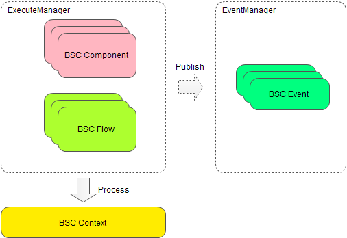

# BSC: Business Service Component

BSC is a processing framework for business service.

Inputs were put in to a context. BSC processed the context. After that we can get outputs from the context.



## BSC Flow

Flow component for BSC.
It is one of the most important parts of BSC.
It contains Flow Model, Flow Editor and Flow Execution.

About Flow Model, we need to know these concepts.
* Flow Action - Every process can be an Action.
* Flow Direction - A connection that leads to another Action.
* Flow Definition - A definition that describes how the Flow runs.
* Flow Instance - An instance which the Flow runs.

Flow Editors are available now.
* [Flow Editor for Eclipse](bsc-flow-editor-eclipse/org.fs.bsc.flow.editor.BSCFlowEditor_1.0.0.201908011110.jar)
* [Flow Editor for IntelliJ IDEA (Preview)](bsc-flow-editor-idea/bsc-flow-editor-idea.jar)

### Default Starter
example:
```java
// Configuration
BscInitParams.loadProperties("/bsc_config.properties");
BscServiceProvider provider = new BscServiceProvider();
provider.init(new DefaultBscConfiguration());
BscExecuteManager executerManager = provider.getBscExecuteManager();
BscContextManager contextManager = provider.getBscContextManager();

// Runing a Flow
String componentCode = "flow1";
BscContext context = contextManager.newContext();
context.put("flowId", UUID.randomUUID().toString());
executerManager.execute(componentCode, context);

// Get the result
BscComponent component = executerManager.getComponent(componentCode);
for(BscFieldDef field : component.getOutputFields()){
    System.out.println(field.getCode() + ": " + context.get(field.getCode()));
}
```