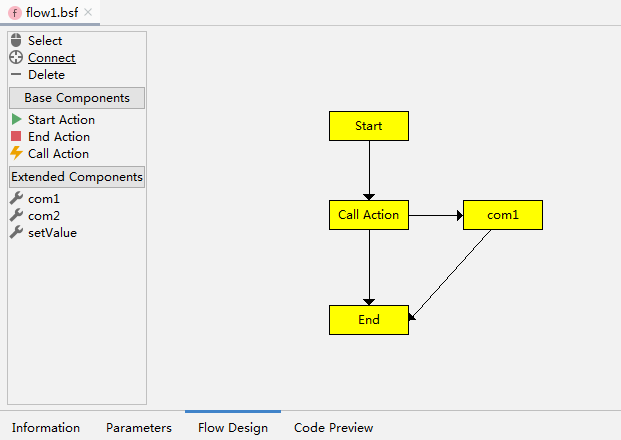

# BSC: Business Service Component（业务服务组件）

BSC 是一个业务服务处理框架。

数据输入到上下文，BSC对上下文进行处理；然后，我们就能从上下文得到输出。


## BSC Flow

BSC 流程组件。
这是BSC中最重要的部分之一。
BSC Flow 包含流程模型、流程编辑器以及流程执行。

关于流程模型，我们需要知道以下几个概念
* 流程活动 - 任意一个操作都是活动
* 流程导向 - 导向另一个活动的连接
* 流程定义 - 描述流程如何执行
* 流程实例 - 流程运行的实例

流程编辑器：
* [Eclipse 流程编辑器](bsc-flow-editor-eclipse/org.fs.bsc.flow.editor.BSCFlowEditor_1.0.0.201908011110.jar)
* [IntelliJ IDEA 流程编辑器（预览）](bsc-flow-editor-idea/bsc-flow-editor-idea.jar)



### Default Starter
例子:
```java
// 配置
BscInitParams.loadProperties("/bsc_config.properties");
BscServiceProvider provider = new BscServiceProvider();
provider.init(new DefaultBscConfiguration());
BscExecuteManager executerManager = provider.getBscExecuteManager();
BscContextManager contextManager = provider.getBscContextManager();

// 运行流程
String componentCode = "flow1";
BscContext context = contextManager.newContext();
context.put("flowId", UUID.randomUUID().toString());
executerManager.execute(componentCode, context);

// 结果输出
BscComponent component = executerManager.getComponent(componentCode);
for(BscFieldDef field : component.getOutputFields()){
    System.out.println(field.getCode() + ": " + context.get(field.getCode()));
}
```